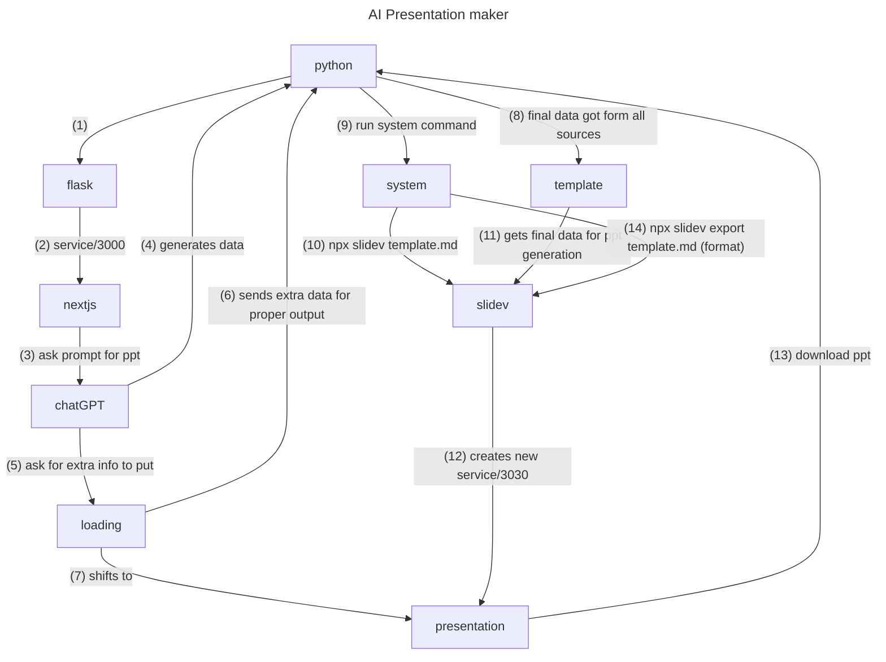

# Template features

- already predefined template
- give the same template to chatGPT and ask for generating blank places defined with []
- AI image generation
- 2 column architecture
- minimilast
- predefined background image
- user details like name, id, and other data will be there (parsed using chatGPT by asking why and for whom is data for)
- every section will have atmost 4-5 points and atleast 2 points
- heading line will be generated separetely
- page nos are there
- current date will be there
- home page background image
- hannk you page
- conclusion page
- on every point there will be a `v-click` class
- code line animation highlight with other lines fade out
- image in every section right side or down side
- contents page will be there
- introduction
