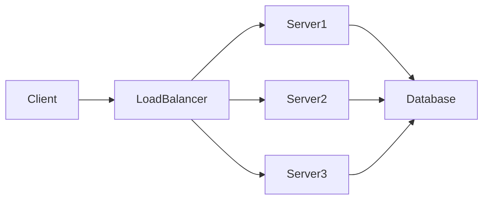

[slide 1]
# Introduction to Load Balancers

In today's world of high-traffic websites and applications, ensuring consistent performance and availability is paramount.  Load balancers are a critical component of modern infrastructure, acting as traffic directors to optimize resource utilization and prevent service disruptions. They distribute incoming network traffic across multiple servers, preventing any single server from becoming overloaded.

This distribution ensures high availability and fault tolerance.  By distributing the load, load balancers increase the overall capacity and resilience of your application.


[slide 1]


[slide 2]
# How Load Balancers Work

Load balancers operate by acting as a reverse proxy, receiving incoming requests and forwarding them to the most appropriate backend server.  They employ various algorithms to distribute the traffic, ensuring a balanced load across all available servers.  This prevents bottlenecks and ensures optimal performance, even under peak demand.


[slide 2]


[slide 3]
# Types of Load Balancers

* **Round Robin:** Distributes requests sequentially to each server.  Example: Server 1, Server 2, Server 3, Server 1...
* **Least Connections:** Directs traffic to the server with the fewest active connections.  This minimizes wait times.
* **IP Hash:** Uses the client's IP address to consistently route requests to the same server.  Useful for maintaining session state.
* **Weighted Round Robin:**  Distributes requests based on server capacity, giving more weight to higher-capacity servers.


[slide 3]


[slide 4]
# Load Balancing Algorithms: A Deeper Dive

Load balancing algorithms are the heart of a load balancer's functionality, determining how incoming requests are distributed.  Different algorithms offer various advantages depending on the specific needs of the application.  Choosing the right algorithm is crucial for optimizing performance and scalability.


[slide 4]


[slide 5]
# Example: Round Robin Algorithm (Python Snippet)

```python
servers = ["server1", "server2", "server3"]
index = 0

def get_next_server():
    global index
    server = servers[index]
    index = (index + 1) % len(servers)
    return server

# Example usage:
print(get_next_server()) # Output: server1
print(get_next_server()) # Output: server2
print(get_next_server()) # Output: server3
print(get_next_server()) # Output: server1
```


[slide 5]


[slide 6]
#  Load Balancer Architecture




[slide 6]


[slide 7]
# Benefits of Using a Load Balancer

Improved performance, increased availability, enhanced scalability, better resource utilization, simplified management.


[slide 7]


[slide 8]
# Common Load Balancer Implementations

* **Hardware Load Balancers:** Dedicated appliances offering high performance and reliability.  Often used in large-scale deployments.
* **Software Load Balancers:** Run on servers, offering flexibility and cost-effectiveness.  Suitable for smaller deployments.
* **Cloud-Based Load Balancers:** Provided by cloud providers like AWS, Azure, and GCP, easily integrated with cloud services.


[slide 8]


[slide 9]
#  Health Checks and Failover

Load balancers constantly monitor the health of backend servers. If a server fails, the load balancer automatically removes it from the pool and redirects traffic to healthy servers, ensuring uninterrupted service.


[slide 9]


[slide 10]
#  Session Persistence

Maintaining session state across multiple servers is crucial for certain applications.  Load balancers can use techniques like IP hashing or sticky sessions to ensure that requests from the same client always go to the same server.


[slide 10]


[slide 11]
# Security Considerations

Load balancers play a vital role in security by acting as a single point of entry for traffic, allowing for easier implementation of security measures like firewalls and intrusion detection systems.


[slide 11]


[slide 12]
# Conclusion

Load balancers are indispensable for modern applications, providing crucial benefits like improved performance, high availability, and scalability. By intelligently distributing network traffic, they ensure optimal resource utilization and prevent service disruptions, ultimately enhancing the user experience and application reliability.  Understanding the different types and configurations of load balancers is key to building robust and efficient applications.


[slide 12]

