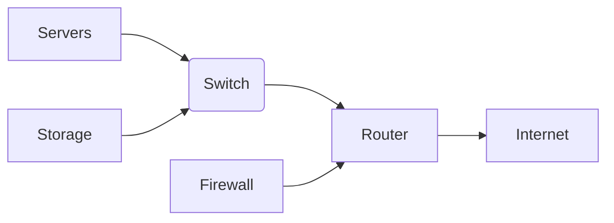

## Artificial Intelligence

`The ICFAI University, Tripura`

<div class="pt-8">
  <span class="px-2 py-1 rounded cursor-pointer" hover="bg-white bg-opacity-10" v-mark="{ at: 1, color: 'red', type: 'underline' }">
    Presented by <code>Dipan Nama</code>
  </span>
</div>

<div style="position: absolute; bottom: 50px; left: 50px; font-size: 0.8em; color: #4ad46e;">
  <code>Branch: MCA</code>
  <br/>
  <code>23IUT0030005</code>
  <br/>
  <code>Nov 25, 2024</code>
</div>

---
layout: image-right
transition: fade-out
layoutClass: gap-16
image: https://mycvcreator.com/administrator/postimages/64a7c4a7005ed1.20845803.jpg
---

## Table of contents

<hr style='border: 0; height: 2px; background: linear-gradient(to right, #ff7e5f, #feb47b); margin: 20px 0;' />

  <Toc
  minDepth="1" 
  maxDepth="2" 
  listClass='' 
  mode="all"
></Toc>


---
transition: fade-out
layout: image-right
title: Introduction
image: https://www.medianama.com/wp-content/uploads/2024/06/ai-8529399_1920.jpg
---

## Artificial Intelligence

<hr style='border: 0; height: 2px; background: linear-gradient(to right, #ff7e5f, #feb47b); margin: 20px 0;' />


<div style="position: absolute; top: 20px; right: 20px; font-size: 0.6em; color: #4ad46e;">
  <code>
    <SlideCurrentNo /> / <SlidesTotal />
  </code>
</div>


<p style="font-size:0.7em;"
  class="text-slate-400 tracking-wide text-justify"
  v-click
  v-motion
  :initial="{ y: 180 }"
  :enter="{ y: 0 }"
  :leave="{ y: 80 }">

Artificial intelligence (AI) is a wide-ranging branch of computer science concerned with building smart machines capable of performing tasks that typically require human intelligence.
</p>

<p style="font-size:0.7em;"
  class="text-slate-400 tracking-wide text-justify"
  v-click
  v-motion
  :initial="{ y: 180 }"
  :enter="{ y: 0 }"
  :leave="{ y: 80 }">

AI is an interdisciplinary science with multiple approaches, but advancements in machine learning and deep learning are creating a paradigm shift in virtually every sector of the tech industry.
</p>

---
transition: fade-out
layout: image-left
title: Data Center Infrastructure An Overview
image: https://www.medianama.com/wp-content/uploads/2024/06/ai-8529399_1920.jpg
---

## Data Center Infrastructure: An Overview

<hr style='border: 0; height: 2px; background: linear-gradient(to right, #ff7e5f, #feb47b); margin: 20px 0;' />


<div style="position: absolute; top: 20px; right: 20px; font-size: 0.6em; color: #4ad46e;">
  <code>
    <SlideCurrentNo /> / <SlidesTotal />
  </code>
</div>


<p style="font-size:0.7em;"
  class="text-slate-400 tracking-wide text-justify"
  v-click
>

Data centers are the backbone of the modern digital world, housing the servers, networking equipment, and storage systems that power our applications and services.  They are complex and critical infrastructure requiring careful planning and management to ensure high availability and performance.  Understanding their components and operation is essential for anyone working in IT.
These sophisticated facilities demand significant investment in hardware, software, and skilled personnel.  Efficient operation is paramount to minimizing costs and maximizing return on investment.
</p>

---
transition: fade-out
layout: image-left
title: Core Components of a Data Center
image: https://www.medianama.com/wp-content/uploads/2024/06/ai-8529399_1920.jpg
---

## Core Components of a Data Center

<hr style='border: 0; height: 2px; background: linear-gradient(to right, #ff7e5f, #feb47b); margin: 20px 0;' />


<div style="position: absolute; top: 20px; right: 20px; font-size: 0.6em; color: #4ad46e;">
  <code>
    <SlideCurrentNo /> / <SlidesTotal />
  </code>
</div>


<p style="font-size:0.7em;"
  class="text-slate-400 tracking-wide text-justify"
  v-click
>

Data centers rely on several key components working together seamlessly.  These components include servers, networking equipment (switches, routers, firewalls), storage systems (SANs, NAS, cloud storage), power infrastructure (UPS, generators), and cooling systems.  Effective management of these components is crucial for optimal performance and resilience.  Let's delve deeper into each of these critical elements.
</p>

--- 
transition: fade-out
layout: image-right
title: Servers The Heart of the Data Center
image: https://www.medianama.com/wp-content/uploads/2024/06/ai-8529399_1920.jpg
---

## Servers: The Heart of the Data Center

<hr style='border: 0; height: 2px; background: linear-gradient(to right, #ff7e5f, #feb47b); margin: 20px 0;' />


<div style="position: absolute; top: 20px; right: 20px; font-size: 0.6em; color: #4ad46e;">
  <code>
    <SlideCurrentNo /> / <SlidesTotal />
  </code>
</div>


<v-clicks class="text-sm text-slate-400">

* **Servers:**  The fundamental computing units, processing data and running applications.  Examples include web servers, database servers, and application servers.
* **Virtualization:** Allows multiple virtual machines (VMs) to run on a single physical server, improving resource utilization. For example, using VMware vSphere or Microsoft Hyper-V.
* **High-Availability Clusters:** Multiple servers working together to provide redundancy and fault tolerance.  Example:  A cluster of web servers ensures continuous availability.

</v-clicks>

---
transition: fade-out
layout: image-left
title: Networking Connecting the Components
image: https://www.medianama.com/wp-content/uploads/2024/06/ai-8529399_1920.jpg
---

## Networking: Connecting the Components

<hr style='border: 0; height: 2px; background: linear-gradient(to right, #ff7e5f, #feb47b); margin: 20px 0;' />


<div style="position: absolute; top: 20px; right: 20px; font-size: 0.6em; color: #4ad46e;">
  <code>
    <SlideCurrentNo /> / <SlidesTotal />
  </code>
</div>


<p style="font-size:0.7em;"
  class="text-slate-400 tracking-wide text-justify"
  v-click
>

Networking equipment connects servers, storage, and other devices within the data center and to the outside world.  Efficient network design is crucial for performance and scalability.  Network security is also paramount, employing firewalls and intrusion detection systems.
</p>

--- 
transition: fade-out
layout: image-right
title: Storage Data Persistence and Accessibility
image: https://www.medianama.com/wp-content/uploads/2024/06/ai-8529399_1920.jpg
---

## Storage: Data Persistence and Accessibility

<hr style='border: 0; height: 2px; background: linear-gradient(to right, #ff7e5f, #feb47b); margin: 20px 0;' />


<div style="position: absolute; top: 20px; right: 20px; font-size: 0.6em; color: #4ad46e;">
  <code>
    <SlideCurrentNo /> / <SlidesTotal />
  </code>
</div>


<v-clicks class="text-sm text-slate-400">

* **SAN (Storage Area Network):** A dedicated network for storage devices, providing high performance and scalability.
* **NAS (Network Attached Storage):** A simpler storage solution, typically used for file sharing.
* **Cloud Storage:** Offsite storage solutions providing scalability and redundancy. Example: AWS S3, Azure Blob Storage.

</v-clicks>

---
transition: fade-out
layout: image-right
title: Power and Cooling Maintaining Operations
image: https://www.medianama.com/wp-content/uploads/2024/06/ai-8529399_1920.jpg
---

## Power and Cooling: Maintaining Operations

<hr style='border: 0; height: 2px; background: linear-gradient(to right, #ff7e5f, #feb47b); margin: 20px 0;' />


<div style="position: absolute; top: 20px; right: 20px; font-size: 0.6em; color: #4ad46e;">
  <code>
    <SlideCurrentNo /> / <SlidesTotal />
  </code>
</div>


<p style="font-size:0.7em;"
  class="text-slate-400 tracking-wide text-justify"
  v-click
>

Power infrastructure ensures continuous operation, including uninterruptible power supplies (UPS) and backup generators.  Cooling systems prevent overheating, essential for reliable server operation.  Redundancy is critical in both power and cooling to avoid downtime.
</p>

---
transition: fade-out
layout: image-right
title: Data Center Network Diagram
image: https://www.medianama.com/wp-content/uploads/2024/06/ai-8529399_1920.jpg
---

## Data Center Network Diagram

<hr style='border: 0; height: 2px; background: linear-gradient(to right, #ff7e5f, #feb47b); margin: 20px 0;' />


<div style="position: absolute; top: 20px; right: 20px; font-size: 0.6em; color: #4ad46e;">
  <code>
    <SlideCurrentNo /> / <SlidesTotal />
  </code>
</div>


<p style="font-size:0.7em;"
  class="text-slate-400 tracking-wide text-justify"
  v-click
>


</p>

---
transition: fade-out
layout: image-right
title: Security in Data Centers
image: https://www.medianama.com/wp-content/uploads/2024/06/ai-8529399_1920.jpg
---

## Security in Data Centers

<hr style='border: 0; height: 2px; background: linear-gradient(to right, #ff7e5f, #feb47b); margin: 20px 0;' />


<div style="position: absolute; top: 20px; right: 20px; font-size: 0.6em; color: #4ad46e;">
  <code>
    <SlideCurrentNo /> / <SlidesTotal />
  </code>
</div>


<p style="font-size:0.7em;"
  class="text-slate-400 tracking-wide text-justify"
  v-click
>

Security is a multifaceted aspect of data center infrastructure.  This includes physical security (access control, surveillance), network security (firewalls, intrusion detection), and data security (encryption, access controls).  A layered approach is vital to mitigating risks.
</p>

---
transition: fade-out
layout: image-left
title: Automation and Orchestration
image: https://www.medianama.com/wp-content/uploads/2024/06/ai-8529399_1920.jpg
---

## Automation and Orchestration

<hr style='border: 0; height: 2px; background: linear-gradient(to right, #ff7e5f, #feb47b); margin: 20px 0;' />


<div style="position: absolute; top: 20px; right: 20px; font-size: 0.6em; color: #4ad46e;">
  <code>
    <SlideCurrentNo /> / <SlidesTotal />
  </code>
</div>


<p style="font-size:0.7em;"
  class="text-slate-400 tracking-wide text-justify"
  v-click
>

Automating tasks like provisioning, deployment, and monitoring improves efficiency and reduces human error.  Tools like Ansible, Puppet, and Chef are commonly used.  A simple Ansible task example:
```yaml
- name: Install Apache
  apt:
    name: apache2
    state: present
```
</p>

---
transition: fade-out
layout: image-right
title: Monitoring and Management
image: https://www.medianama.com/wp-content/uploads/2024/06/ai-8529399_1920.jpg
---

## Monitoring and Management

<hr style='border: 0; height: 2px; background: linear-gradient(to right, #ff7e5f, #feb47b); margin: 20px 0;' />


<div style="position: absolute; top: 20px; right: 20px; font-size: 0.6em; color: #4ad46e;">
  <code>
    <SlideCurrentNo /> / <SlidesTotal />
  </code>
</div>


<p style="font-size:0.7em;"
  class="text-slate-400 tracking-wide text-justify"
  v-click
>

Real-time monitoring of servers, network, and storage is essential for proactive problem identification and resolution.  Tools like Nagios, Zabbix, and Prometheus collect and analyze data to provide alerts and insights.  A simple metric example: CPU utilization.
</p>

--- 
transition: fade-out
layout: image-left
title: Future Trends in Data Centers
image: https://www.medianama.com/wp-content/uploads/2024/06/ai-8529399_1920.jpg
---

## Future Trends in Data Centers

<hr style='border: 0; height: 2px; background: linear-gradient(to right, #ff7e5f, #feb47b); margin: 20px 0;' />


<div style="position: absolute; top: 20px; right: 20px; font-size: 0.6em; color: #4ad46e;">
  <code>
    <SlideCurrentNo /> / <SlidesTotal />
  </code>
</div>


<v-clicks class="text-sm text-slate-400">

* **Edge Computing:** Processing data closer to the source reduces latency and bandwidth requirements.
* **AI and Machine Learning:**  Used for predictive maintenance, resource optimization, and security threat detection.
* **Sustainable Data Centers:**  Reducing energy consumption and environmental impact through efficient cooling and renewable energy sources.

</v-clicks>

---
transition: fade-out
layout: image-left
title: Conclusion
image: https://www.medianama.com/wp-content/uploads/2024/06/ai-8529399_1920.jpg
---

## Conclusion

<hr style='border: 0; height: 2px; background: linear-gradient(to right, #ff7e5f, #feb47b); margin: 20px 0;' />


<div style="position: absolute; top: 20px; right: 20px; font-size: 0.6em; color: #4ad46e;">
  <code>
    <SlideCurrentNo /> / <SlidesTotal />
  </code>
</div>


<p style="font-size:0.7em;"
  class="text-slate-400 tracking-wide text-justify"
  v-click
>

Data center infrastructure is a complex but critical element of the modern technological landscape.  Understanding its components, their interdependencies, and the importance of security and efficiency is essential for successful IT operations.  Continuous innovation and adaptation are crucial to meet the ever-evolving demands of the digital world.  Effective management, including robust monitoring and automation, allows organizations to maximize their investments while ensuring high availability and performance.
</p>
