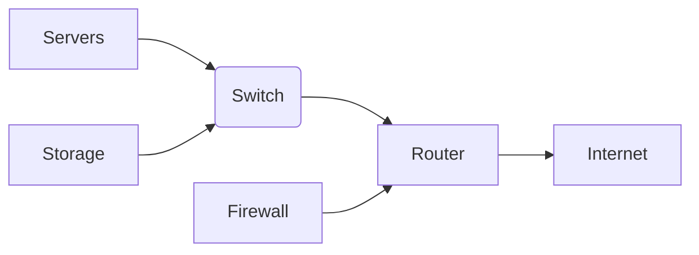

[slide 1]
# Data Center Infrastructure: An Overview

Data centers are the backbone of the modern digital world, housing the servers, networking equipment, and storage systems that power our applications and services.  They are complex and critical infrastructure requiring careful planning and management to ensure high availability and performance.  Understanding their components and operation is essential for anyone working in IT.

These sophisticated facilities demand significant investment in hardware, software, and skilled personnel.  Efficient operation is paramount to minimizing costs and maximizing return on investment.

[slide 1]


[slide 2]
# Core Components of a Data Center

Data centers rely on several key components working together seamlessly.  These components include servers, networking equipment (switches, routers, firewalls), storage systems (SANs, NAS, cloud storage), power infrastructure (UPS, generators), and cooling systems.  Effective management of these components is crucial for optimal performance and resilience.  Let's delve deeper into each of these critical elements.

[slide 2]


[slide 3]
# Servers: The Heart of the Data Center

* **Servers:**  The fundamental computing units, processing data and running applications.  Examples include web servers, database servers, and application servers.
* **Virtualization:** Allows multiple virtual machines (VMs) to run on a single physical server, improving resource utilization. For example, using VMware vSphere or Microsoft Hyper-V.
* **High-Availability Clusters:** Multiple servers working together to provide redundancy and fault tolerance.  Example:  A cluster of web servers ensures continuous availability.

[slide 3]


[slide 4]
# Networking: Connecting the Components

Networking equipment connects servers, storage, and other devices within the data center and to the outside world.  Efficient network design is crucial for performance and scalability.  Network security is also paramount, employing firewalls and intrusion detection systems.

[slide 4]


[slide 5]
# Storage: Data Persistence and Accessibility

* **SAN (Storage Area Network):** A dedicated network for storage devices, providing high performance and scalability.
* **NAS (Network Attached Storage):** A simpler storage solution, typically used for file sharing.
* **Cloud Storage:** Offsite storage solutions providing scalability and redundancy. Example: AWS S3, Azure Blob Storage.

[slide 5]


[slide 6]
# Power and Cooling: Maintaining Operations

Power infrastructure ensures continuous operation, including uninterruptible power supplies (UPS) and backup generators.  Cooling systems prevent overheating, essential for reliable server operation.  Redundancy is critical in both power and cooling to avoid downtime.

[slide 6]


[slide 7]
# Data Center Network Diagram



[slide 7]


[slide 8]
#  Security in Data Centers

Security is a multifaceted aspect of data center infrastructure.  This includes physical security (access control, surveillance), network security (firewalls, intrusion detection), and data security (encryption, access controls).  A layered approach is vital to mitigating risks.

[slide 8]


[slide 9]
# Automation and Orchestration

Automating tasks like provisioning, deployment, and monitoring improves efficiency and reduces human error.  Tools like Ansible, Puppet, and Chef are commonly used.  A simple Ansible task example:

```yaml
- name: Install Apache
  apt:
    name: apache2
    state: present
```

[slide 9]


[slide 10]
# Monitoring and Management

Real-time monitoring of servers, network, and storage is essential for proactive problem identification and resolution.  Tools like Nagios, Zabbix, and Prometheus collect and analyze data to provide alerts and insights.  A simple metric example: CPU utilization.

[slide 10]


[slide 11]
#  Future Trends in Data Centers

* **Edge Computing:** Processing data closer to the source reduces latency and bandwidth requirements.
* **AI and Machine Learning:**  Used for predictive maintenance, resource optimization, and security threat detection.
* **Sustainable Data Centers:**  Reducing energy consumption and environmental impact through efficient cooling and renewable energy sources.


[slide 11]


[slide 12]
# Conclusion

Data center infrastructure is a complex but critical element of the modern technological landscape.  Understanding its components, their interdependencies, and the importance of security and efficiency is essential for successful IT operations.  Continuous innovation and adaptation are crucial to meet the ever-evolving demands of the digital world.  Effective management, including robust monitoring and automation, allows organizations to maximize their investments while ensuring high availability and performance.

[slide 12]

