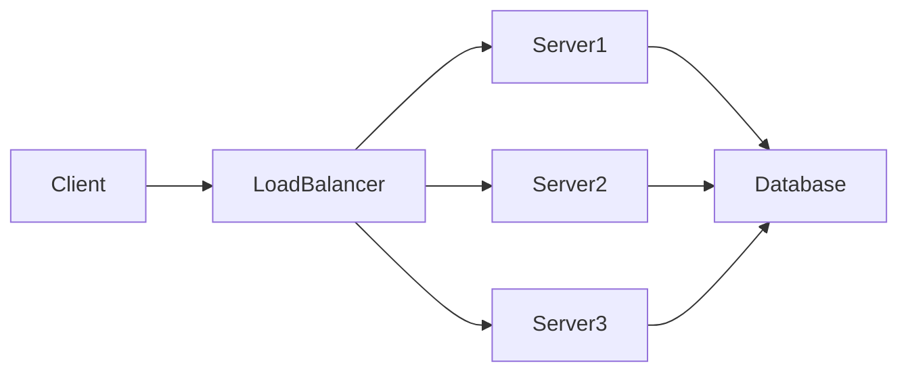

---
transition: fade-out
layout: image-left
title: # Introduction to Load Balancers

image: https://www.medianama.com/wp-content/uploads/2024/06/ai-8529399_1920.jpg
---

# Introduction to Load Balancers


<hr style='border: 0; height: 2px; background: linear-gradient(to right, #ff7e5f, #feb47b); margin: 20px 0;' />


<div style="position: absolute; top: 20px; right: 20px; font-size: 0.6em; color: #4ad46e;">
  <code>
    <SlideCurrentNo /> / <SlidesTotal />
  </code>
</div>


<p style="font-size:0.7em;"
  class="text-slate-400 tracking-wide text-justify"
  v-click
>

In today's world of high-traffic websites and applications, ensuring consistent performance and availability is paramount.  Load balancers are a critical component of modern infrastructure, acting as traffic directors to optimize resource utilization and prevent service disruptions. They distribute incoming network traffic across multiple servers, preventing any single server from becoming overloaded.
This distribution ensures high availability and fault tolerance.  By distributing the load, load balancers increase the overall capacity and resilience of your application.
</p>

---
transition: fade-out
layout: image-right
title: # How Load Balancers Work

image: https://www.medianama.com/wp-content/uploads/2024/06/ai-8529399_1920.jpg
---

# How Load Balancers Work


<hr style='border: 0; height: 2px; background: linear-gradient(to right, #ff7e5f, #feb47b); margin: 20px 0;' />


<div style="position: absolute; top: 20px; right: 20px; font-size: 0.6em; color: #4ad46e;">
  <code>
    <SlideCurrentNo /> / <SlidesTotal />
  </code>
</div>


<p style="font-size:0.7em;"
  class="text-slate-400 tracking-wide text-justify"
  v-click
>

Load balancers operate by acting as a reverse proxy, receiving incoming requests and forwarding them to the most appropriate backend server.  They employ various algorithms to distribute the traffic, ensuring a balanced load across all available servers.  This prevents bottlenecks and ensures optimal performance, even under peak demand.
</p>

--- 
transition: fade-out
layout: image-left
image: https://www.medianama.com/wp-content/uploads/2024/06/ai-8529399_1920.jpg
---

# Types of Load Balancers


<hr style='border: 0; height: 2px; background: linear-gradient(to right, #ff7e5f, #feb47b); margin: 20px 0;' />


<div style="position: absolute; top: 20px; right: 20px; font-size: 0.6em; color: #4ad46e;">
  <code>
    <SlideCurrentNo /> / <SlidesTotal />
  </code>
</div>


<v-clicks class="text-sm text-slate-400">

* **Round Robin:** Distributes requests sequentially to each server.  Example: Server 1, Server 2, Server 3, Server 1...
* **Least Connections:** Directs traffic to the server with the fewest active connections.  This minimizes wait times.
* **IP Hash:** Uses the client's IP address to consistently route requests to the same server.  Useful for maintaining session state.
* **Weighted Round Robin:**  Distributes requests based on server capacity, giving more weight to higher-capacity servers.

</v-clicks>

---
transition: fade-out
layout: image-left
title: # Load Balancing Algorithms: A Deeper Dive

image: https://www.medianama.com/wp-content/uploads/2024/06/ai-8529399_1920.jpg
---

# Load Balancing Algorithms: A Deeper Dive


<hr style='border: 0; height: 2px; background: linear-gradient(to right, #ff7e5f, #feb47b); margin: 20px 0;' />


<div style="position: absolute; top: 20px; right: 20px; font-size: 0.6em; color: #4ad46e;">
  <code>
    <SlideCurrentNo /> / <SlidesTotal />
  </code>
</div>


<p style="font-size:0.7em;"
  class="text-slate-400 tracking-wide text-justify"
  v-click
>

Load balancing algorithms are the heart of a load balancer's functionality, determining how incoming requests are distributed.  Different algorithms offer various advantages depending on the specific needs of the application.  Choosing the right algorithm is crucial for optimizing performance and scalability.
</p>

---
transition: fade-out
layout: image-right
title: # Example: Round Robin Algorithm (Python Snippet)

image: https://www.medianama.com/wp-content/uploads/2024/06/ai-8529399_1920.jpg
---

# Example: Round Robin Algorithm (Python Snippet)


<hr style='border: 0; height: 2px; background: linear-gradient(to right, #ff7e5f, #feb47b); margin: 20px 0;' />


<div style="position: absolute; top: 20px; right: 20px; font-size: 0.6em; color: #4ad46e;">
  <code>
    <SlideCurrentNo /> / <SlidesTotal />
  </code>
</div>


<p style="font-size:0.7em;"
  class="text-slate-400 tracking-wide text-justify"
  v-click
>

```python
servers = ["server1", "server2", "server3"]
index = 0
def get_next_server():
    global index
    server = servers[index]
    index = (index + 1) % len(servers)
    return server
# Example usage:
print(get_next_server()) # Output: server1
print(get_next_server()) # Output: server2
print(get_next_server()) # Output: server3
print(get_next_server()) # Output: server1
```
</p>

---
transition: fade-out
layout: image-right
title: #  Load Balancer Architecture

image: https://www.medianama.com/wp-content/uploads/2024/06/ai-8529399_1920.jpg
---

#  Load Balancer Architecture


<hr style='border: 0; height: 2px; background: linear-gradient(to right, #ff7e5f, #feb47b); margin: 20px 0;' />


<div style="position: absolute; top: 20px; right: 20px; font-size: 0.6em; color: #4ad46e;">
  <code>
    <SlideCurrentNo /> / <SlidesTotal />
  </code>
</div>


<p style="font-size:0.7em;"
  class="text-slate-400 tracking-wide text-justify"
  v-click
>


</p>

---
transition: fade-out
layout: image-left
title: # Benefits of Using a Load Balancer

image: https://www.medianama.com/wp-content/uploads/2024/06/ai-8529399_1920.jpg
---

# Benefits of Using a Load Balancer


<hr style='border: 0; height: 2px; background: linear-gradient(to right, #ff7e5f, #feb47b); margin: 20px 0;' />


<div style="position: absolute; top: 20px; right: 20px; font-size: 0.6em; color: #4ad46e;">
  <code>
    <SlideCurrentNo /> / <SlidesTotal />
  </code>
</div>


<p style="font-size:0.7em;"
  class="text-slate-400 tracking-wide text-justify"
  v-click
>

Improved performance, increased availability, enhanced scalability, better resource utilization, simplified management.
</p>

--- 
transition: fade-out
layout: image-right
image: https://www.medianama.com/wp-content/uploads/2024/06/ai-8529399_1920.jpg
---

# Common Load Balancer Implementations


<hr style='border: 0; height: 2px; background: linear-gradient(to right, #ff7e5f, #feb47b); margin: 20px 0;' />


<div style="position: absolute; top: 20px; right: 20px; font-size: 0.6em; color: #4ad46e;">
  <code>
    <SlideCurrentNo /> / <SlidesTotal />
  </code>
</div>


<v-clicks class="text-sm text-slate-400">

* **Hardware Load Balancers:** Dedicated appliances offering high performance and reliability.  Often used in large-scale deployments.
* **Software Load Balancers:** Run on servers, offering flexibility and cost-effectiveness.  Suitable for smaller deployments.
* **Cloud-Based Load Balancers:** Provided by cloud providers like AWS, Azure, and GCP, easily integrated with cloud services.

</v-clicks>

---
transition: fade-out
layout: image-right
title: #  Health Checks and Failover

image: https://www.medianama.com/wp-content/uploads/2024/06/ai-8529399_1920.jpg
---

#  Health Checks and Failover


<hr style='border: 0; height: 2px; background: linear-gradient(to right, #ff7e5f, #feb47b); margin: 20px 0;' />


<div style="position: absolute; top: 20px; right: 20px; font-size: 0.6em; color: #4ad46e;">
  <code>
    <SlideCurrentNo /> / <SlidesTotal />
  </code>
</div>


<p style="font-size:0.7em;"
  class="text-slate-400 tracking-wide text-justify"
  v-click
>

Load balancers constantly monitor the health of backend servers. If a server fails, the load balancer automatically removes it from the pool and redirects traffic to healthy servers, ensuring uninterrupted service.
</p>

---
transition: fade-out
layout: image-left
title: #  Session Persistence

image: https://www.medianama.com/wp-content/uploads/2024/06/ai-8529399_1920.jpg
---

#  Session Persistence


<hr style='border: 0; height: 2px; background: linear-gradient(to right, #ff7e5f, #feb47b); margin: 20px 0;' />


<div style="position: absolute; top: 20px; right: 20px; font-size: 0.6em; color: #4ad46e;">
  <code>
    <SlideCurrentNo /> / <SlidesTotal />
  </code>
</div>


<p style="font-size:0.7em;"
  class="text-slate-400 tracking-wide text-justify"
  v-click
>

Maintaining session state across multiple servers is crucial for certain applications.  Load balancers can use techniques like IP hashing or sticky sessions to ensure that requests from the same client always go to the same server.
</p>

---
transition: fade-out
layout: image-right
title: # Security Considerations

image: https://www.medianama.com/wp-content/uploads/2024/06/ai-8529399_1920.jpg
---

# Security Considerations


<hr style='border: 0; height: 2px; background: linear-gradient(to right, #ff7e5f, #feb47b); margin: 20px 0;' />


<div style="position: absolute; top: 20px; right: 20px; font-size: 0.6em; color: #4ad46e;">
  <code>
    <SlideCurrentNo /> / <SlidesTotal />
  </code>
</div>


<p style="font-size:0.7em;"
  class="text-slate-400 tracking-wide text-justify"
  v-click
>

Load balancers play a vital role in security by acting as a single point of entry for traffic, allowing for easier implementation of security measures like firewalls and intrusion detection systems.
</p>

---
transition: fade-out
layout: image-left
title: # Conclusion

image: https://www.medianama.com/wp-content/uploads/2024/06/ai-8529399_1920.jpg
---

# Conclusion


<hr style='border: 0; height: 2px; background: linear-gradient(to right, #ff7e5f, #feb47b); margin: 20px 0;' />


<div style="position: absolute; top: 20px; right: 20px; font-size: 0.6em; color: #4ad46e;">
  <code>
    <SlideCurrentNo /> / <SlidesTotal />
  </code>
</div>


<p style="font-size:0.7em;"
  class="text-slate-400 tracking-wide text-justify"
  v-click
>

Load balancers are indispensable for modern applications, providing crucial benefits like improved performance, high availability, and scalability. By intelligently distributing network traffic, they ensure optimal resource utilization and prevent service disruptions, ultimately enhancing the user experience and application reliability.  Understanding the different types and configurations of load balancers is key to building robust and efficient applications.
</p>
