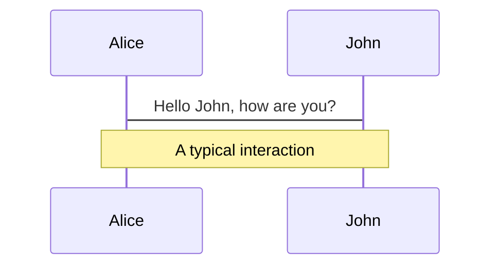
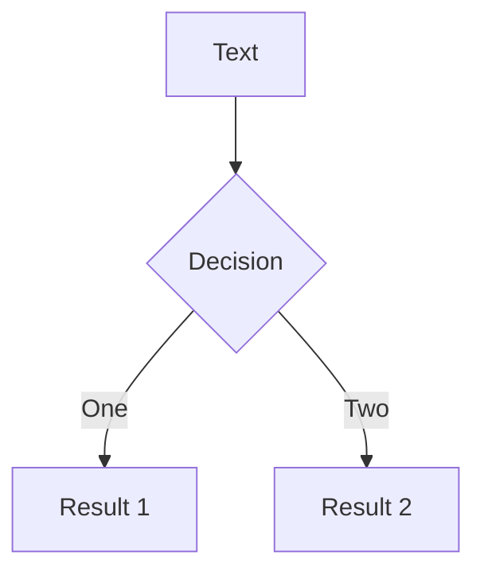
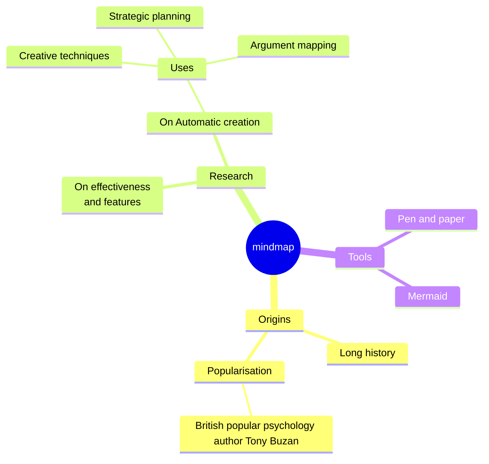
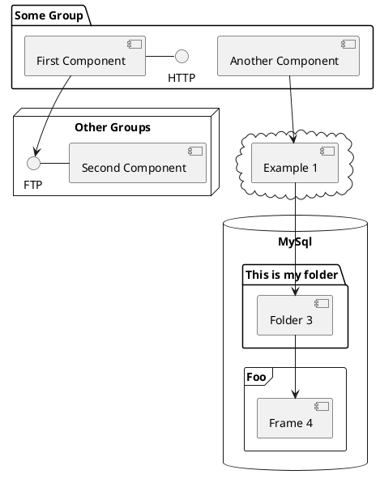

## Presentation Headline

`The ICFAI University, Tripura`


<div class="pt-8">
  <span class="px-2 py-1 rounded cursor-pointer" hover="bg-white bg-opacity-10" v-mark="{ at: 1, color: 'red', type: 'underline' }">
    Presented by <code>Dipan Nama</code>
  </span>
</div>

<div style="position: absolute; bottom: 50px; left: 50px; font-size: 0.8em; color: #4ad46e;">
  <code>Branch: MCA</code>
  <br/>
  <code>23IUT0030005</code>
  <br/>
  <code>
  {{ new Date().toLocaleString('en-US', { month: 'short', day: 'numeric', year: 'numeric' }).replace(/(\d)(st|nd|rd|th)/, '$1$2') }}
  </code>
</div>

---
layout: image-right
transition: fade-out
layoutClass: gap-16
image: https://mycvcreator.com/administrator/postimages/64a7c4a7005ed1.20845803.jpg
---

## Table of contents

<hr style="border: 0; height: 2px; background: linear-gradient(to right, #ff7e5f, #feb47b); margin: 20px 0;" />

<Toc
  v-click 
  minDepth="1" 
  maxDepth="1" u
  listClass='' 
  v-motion
  :initial="{ x: -80 }"
  :enter="{ x: 0 }"
  :leave="{ x: 80 }"></Toc>


---
transition: fade-out
layout: image-right
title: Introduction
image: https://www.medianama.com/wp-content/uploads/2024/06/ai-8529399_1920.jpg
---

# Left side text

<hr style="border: 0; height: 2px; background: linear-gradient(to right, #ff7e5f, #feb47b); margin: 20px 0;" />

<div style="font-size:0.7em;"
  class="text-slate-400 tracking-wide text-justify"
  v-click
  v-motion
  :initial="{ y: 180 }"
  :enter="{ y: 0 }"
  :leave="{ y: 80 }">

Three-tier architecture is a structured design model that separates an application into three distinct layers: presentation, business logic, and data. This separation improves modularity and simplifies development and maintenance. By isolating each layer, developers can work independently on user interfaces, application logic, and database management.
</div>

<p style="font-size:0.7em;"
  class="text-slate-400 tracking-wide text-justify"
  v-click
  v-motion
  :initial="{ y: 180 }"
  :enter="{ y: 0 }"
  :leave="{ y: 80 }">

It is widely used in enterprise systems and cloud-based applications for its flexibility. Each layer operates independently, ensuring easier maintenance and efficient performance.
</p>

<div style="position: absolute; top: 20px; right: 20px; font-size: 0.6em; color: #4ad46e;">
  <code>
    <SlideCurrentNo /> / <SlidesTotal />
  </code>
</div>


--- 
transition: fade-out
layout: image-right
image: https://www.medianama.com/wp-content/uploads/2024/06/ai-8529399_1920.jpg
---

# Left side text with list points

<hr style="border: 0; height: 2px; background: linear-gradient(to right, #ff7e5f, #feb47b); margin: 20px 0;" />

<div style="position: absolute; top: 20px; right: 20px; font-size: 0.6em; color: #4ad46e;">
  <code>
    <SlideCurrentNo /> / <SlidesTotal />
  </code>
</div>

<v-clicks class="text-sm text-slate-400">

- What is Artificial Intelligence (AI)?  
- Importance in today world  
- Examples: Virtual assistants, autonomous cars  

</v-clicks>


--- 
transition: fade-out
layout: image-right
image: https://www.medianama.com/wp-content/uploads/2024/06/ai-8529399_1920.jpg
---

# Left side list wtth explained point

<hr style="border: 0; height: 2px; background: linear-gradient(to right, #ff7e5f, #feb47b); margin: 20px 0;" />

<div style="position: absolute; top: 20px; right: 20px; font-size: 0.6em; color: #4ad46e;">
  <code>
    <SlideCurrentNo /> / <SlidesTotal />
  </code>
</div>

<v-clicks class="text-sm">


- **Healthcare:** Disease diagnosis, personalized medicine  
- **Finance:** Fraud detection, trading algorithms  
- **Robotics:** Industrial automation, service robots  
- **Autonomous Vehicles:** Self-driving technology  

</v-clicks>

---
transition: fade-out
layout: image-left
image: https://www.medianama.com/wp-content/uploads/2024/06/ai-8529399_1920.jpg
---

# Right Side Text

<hr style="border: 0; height: 2px; background: linear-gradient(to right, #ff7e5f, #feb47b); margin: 20px 0;" />

<div style="position: absolute; top: 20px; right: 20px; font-size: 0.6em; color: #4ad46e;">
  <code>
    <SlideCurrentNo /> / <SlidesTotal />
  </code>
</div>

<div style="font-size:0.7em;"
  class="text-slate-400 tracking-wide text-justify"
  v-click
  v-motion
  :initial="{ y: 180 }"
  :enter="{ y: 0 }"
  :leave="{ y: 80 }">

Three-tier architecture is a structured design model that separates an application into three distinct layers: presentation, business logic, and data. This separation improves modularity and simplifies development and maintenance. By isolating each layer, developers can work independently on user interfaces, application logic, and database management.
</div>

<div style="font-size:0.7em;"
  class="text-slate-400 tracking-wide text-justify"
  v-click
  v-motion
  :initial="{ y: 180 }"
  :enter="{ y: 0 }"
  :leave="{ y: 80 }">

It is widely used in enterprise systems and cloud-based applications for its flexibility. Each layer operates independently, ensuring easier maintenance and efficient performance.
</div>

--- 
transition: fade-out
layout: image-left
image: https://www.medianama.com/wp-content/uploads/2024/06/ai-8529399_1920.jpg
---

# Right side text with list points

<hr style="border: 0; height: 2px; background: linear-gradient(to right, #ff7e5f, #feb47b); margin: 20px 0;" />

<div style="position: absolute; top: 20px; right: 20px; font-size: 0.6em; color: #4ad46e;">
  <code>
    <SlideCurrentNo /> / <SlidesTotal />
  </code>
</div>

<v-clicks class="text-sm text-slate-400">

- What is Artificial Intelligence (AI)?  
- Importance in today world  
- Examples: Virtual assistants, autonomous cars  

</v-clicks>

--- 
transition: fade-out
layout: image-left
image: https://www.medianama.com/wp-content/uploads/2024/06/ai-8529399_1920.jpg
---

# Right side list wtth explained point

<hr style="border: 0; height: 2px; background: linear-gradient(to right, #ff7e5f, #feb47b); margin: 20px 0;" />

<div style="position: absolute; top: 20px; right: 20px; font-size: 0.6em; color: #4ad46e;">
  <code>
    <SlideCurrentNo /> / <SlidesTotal />
  </code>
</div>

<v-clicks class="text-sm">


- **Healthcare:** Disease diagnosis, personalized medicine  
- **Finance:** Fraud detection, trading algorithms  
- **Robotics:** Industrial automation, service robots  
- **Autonomous Vehicles:** Self-driving technology  

</v-clicks>


---
layout: default
---

# Comparison Table  

| Feature         | Option A        | Option B        |  
|------------------|-----------------|-----------------|  
| Scalability      | High            | Medium          |  
| Cost             | Low             | High            |  
| Efficiency       | High            | Low             |  
| Efficiency       | High            | Low             |  
| Efficiency       | High            | Low             |

---
layout: default
---

# AI in Healthcare  

<div style="display: flex; align-items: center; gap: 20px;">
  <div>
    <h2>AI Applications in Healthcare</h2>
    <p>AI is transforming the healthcare industry by enhancing diagnostics, improving treatment planning, and enabling personalized medicine.</p>
  </div>
  
</div>


---

# Linear Regression with Gradient Descent

```mermaid
graph LR;
    A[Start] --> B[Define the Cost Function MSE];
    B --> C[Initialize Weights w and Bias b];
    C --> D[Compute Predictions y_pred = w * x + b];
    D --> E[Calculate Gradient of Cost Function];
    E --> F[Update Weights w = w - alpha * Gradient];
    F --> G[Update Bias b = b - alpha * Gradient];
    G --> H[Repeat Until Convergence];
    H --> I[Final Model y = w * x + b];
    I --> J[End];
```



---
layout: image-right
image: https://cover.sli.dev
hideInToc: true
---

# Code

<div style="position: absolute; top: 20px; right: 20px; font-size: 0.6em; color: #4ad46e;">
  <code>
    <SlideCurrentNo /> / <SlidesTotal />
  </code>
</div>

Use code snippets and get the highlighting directly, and even types hover!
eh! <h1>helloo</h1>

```ts {none|5|7|7-8|10|all} twoslash
// TwoSlash enables TypeScript hover information
// and errors in markdown code blocks
// More at https://shiki.style/packages/twoslash

import { computed, ref } from 'vue'

const count = ref(0)
const doubled = computed(() => count.value * 2)

doubled.value = 2
```

<arrow v-click="[4, 5]" x1="350" y1="310" x2="195" y2="334" color="#953" width="2" arrowSize="1" />

<!-- This allow you to embed external code blocks -->
<<< @/snippets/external.ts#snippet

---
level: 2
hideInToc: true
---

# Magic Code Walkthrough

Powered by [shiki-magic-move](https://shiki-magic-move.netlify.app/), Slidev supports animations across multiple code snippets.

Add multiple code blocks and wrap them with <code>````md magic-move</code> (four backticks) to enable the magic move. For example:

````md magic-move {lines: true}
```ts {*|2|*}
// step 1
const author = reactive({
  name: 'John Doe',
  books: [
    'Vue 2 - Advanced Guide',
    'Vue 3 - Basic Guide',      
    'Vue 4 - The Mystery'
  ]
})
```

```ts {*|1-2|3-4|3-4,8}
// step 2
export default {
  data() {
    return {
      author: {
        name: 'John Doe',
        books: [
          'Vue 2 - Advanced Guide',
          'Vue 3 - Basic Guide',
          'Vue 4 - The Mystery'
        ]
      }
    }
  }
}
```

```ts {2|*}
// step 3
export default {
  data: () => ({
    author: {
      name: 'John Doe',
      books: [
        'Vue 2 - Advanced Guide',
        'Vue 3 - Basic Guide',
        'Vue 4 - The Mystery'
      ]
    }
  })
}
```

Non-code blocks are ignored.

```vue
<!-- step 4 -->
<script setup>
const author = {
  name: 'John Doe',
  books: [
    'Vue 2 - Advanced Guide',
    'Vue 3 - Basic Guide',
    'Vue 4 - The Mystery'
  ]
}
</script>
```
````

---
hideInToc: true
---

# Components

<div grid="~ cols-2 gap-4">
<div>

You can use Vue components directly inside your slides.

We have provided a few built-in components like `<Tweet/>` and `<Youtube/>` that you can use directly. And adding your custom components is also super easy.

```html
<Counter :count="10" /> 
```

<!-- ./components/Counter.vue -->
<Counter :count="10" m="t-4" />

Check out [the guides](https://sli.dev/builtin/components.html) for more.

</div>
<div>

```html
<Tweet id="1390115482657726468" />
```

<Tweet id="1390115482657726468" scale="0.65" />

</div>
</div>

<!--
Presenter note with **bold**, *italic*, and ~~striked~~ text.

Also, HTML elements are valid:
<div class="flex w-full">
  <span style="flex-grow: 1;">Left content</span>
  <span>Right content</span>
</div>
-->

---
class: px-20
hideInToc: true
---

# Themes

Slidev comes with powerful theming support. Themes can provide styles, layouts, components, or even configurations for tools. Switching between themes by just **one edit** in your frontmatter:

<div grid="~ cols-2 gap-2" m="t-2">

```yaml
---
theme: default
---
```

```yaml
---
theme: seriph
---
```


</div>

Read more about [How to use a theme](https://sli.dev/guide/theme-addon#use-theme) and
check out the [Awesome Themes Gallery](https://sli.dev/resources/theme-gallery).

---
hideInToc: true
---

# Clicks Animations

You can add `v-click` to elements to add a click animation.

<div v-click>

This shows up when you click the slide:

```html
<div v-click>This shows up when you click the slide.</div>
```

</div>

<br>

<v-click>

The <span v-mark.red="3"><code>v-mark</code> directive</span>
also allows you to add
<span v-mark.circle.orange="4">inline marks</span>
, powered by [Rough Notation](https://roughnotation.com/):

```html
<span v-mark.underline.orange>inline markers</span>
```

</v-click>

<div mt-20 v-click>

[Learn more](https://sli.dev/guide/animations#click-animation)

</div>

---
hideInToc: true
---

# Motions

Motion animations are powered by [@vueuse/motion](https://motion.vueuse.org/), triggered by `v-motion` directive.

```html
<div
  v-motion
  :initial="{ x: -80 }"
  :enter="{ x: 0 }"
  :click-3="{ x: 80 }"
  :leave="{ x: 1000 }"
>
  presentrinity
</div>
```

<div class="w-60 relative">
  <div class="relative w-40 h-40">
    
    
    
  </div>

  <div
    class="text-5xl absolute top-14 left-40 text-[#2B90B6] -z-1"
    v-motion
    :initial="{ x: -80, opacity: 0}"
    :enter="{ x: 0, opacity: 1, transition: { delay: 2000, duration: 1000 } }">
    Slidev
  </div>
</div>

<!-- vue script setup scripts can be directly used in markdown, and will only affects current page -->
<script setup lang="ts">
const final = {
  x: 0,
  y: 0,
  rotate: 0,
  scale: 1,
  transition: {
    type: 'spring',
    damping: 10,
    stiffness: 20,
    mass: 2
  }
}
</script>

<div
  v-motion
  :initial="{ x:35, y: 30, opacity: 0}"
  :enter="{ y: 0, opacity: 1, transition: { delay: 3500 } }">

[Learn more](https://sli.dev/guide/animations.html#motion)

</div>

---
hideInToc: true
---

# LaTeX

LaTeX is supported out-of-box. Powered by [KaTeX](https://katex.org/).

<div h-3 />

Inline $\sqrt{3x-1}+(1+x)^2$

Block
$$ {1|3|all}
\begin{aligned}
\nabla \cdot \vec{E} &= \frac{\rho}{\varepsilon_0} \\
\nabla \cdot \vec{B} &= 0 \\
\nabla \times \vec{E} &= -\frac{\partial\vec{B}}{\partial t} \\
\nabla \times \vec{B} &= \mu_0\vec{J} + \mu_0\varepsilon_0\frac{\partial\vec{E}}{\partial t}
\end{aligned}
$$

[Learn more](https://sli.dev/features/latex)

---
hideInToc: true
---

# Diagrams

You can create diagrams / graphs from textual descriptions, directly in your Markdown.

<div class="grid grid-cols-4 gap-5 pt-4 -mb-6">









</div>

Learn more: [Mermaid Diagrams](https://sli.dev/features/mermaid) and [PlantUML Diagrams](https://sli.dev/features/plantuml)

---
foo: bar
dragPos:
  square: 624,129,167,_
hideInToc: true
---

# Draggable Elements

Double-click on the draggable elements to edit their positions.

<br>

###### Directive Usage

```md

```

<br>

###### Component Usage

```md
<v-drag text-3xl>
  <carbon:arrow-up />
  Use the `v-drag` component to have a draggable container!
</v-drag>
```

<v-drag pos="623,61,261,_">
  <div text-center text-3xl border border-main rounded>
    Double-click me!
  </div>
</v-drag>


###### Draggable Arrow

```md
<v-drag-arrow two-way />
```

<v-drag-arrow pos="322,219,-2,279" two-way op70 />

---
src: ./pages/imported-slides.md
hide: false
hideInToc: true
---

---

# Monaco Editor

Slidev provides built-in Monaco Editor support.

Add `{monaco}` to the code block to turn it into an editor:

```ts {monaco}
import { ref } from 'vue'
import { emptyArray } from './external'

const arr = ref(emptyArray(10))
```

Use `{monaco-run}` to create an editor that can execute the code directly in the slide:

```ts {monaco-run}
import { version } from 'vue'
import { emptyArray, sayHello } from './external'

sayHello()
console.log(`vue ${version}`)
console.log(emptyArray<number>(10).reduce(fib => [...fib, fib.at(-1)! + fib.at(-2)!], [1, 1]))
console.log('Dipan Nama')
```

---
layout: center
class: text-center
hideInToc: true
---

  <h1 class="px-2 py-1 rounded cursor-pointer" hover="bg-white bg-opacity-10" v-mark="{ at: +1, color: 'red', type: 'underline' }">
    Thank You
  </h1>

<!-- [Documentation](https://sli.dev) · [GitHub](https://github.com/slidevjs/slidev) · [Showcases](https://sli.dev/resources/showcases) -->
